# Countrypedia

This web application shows you the list of many countries. You can not only see the list of countries, but also search for countries, get information such as the flag, coat of arms, population, region of the country you selected. [Click here](https://countrypedia.app/) for visit website.

# UPDATE: V2 has arrived!

In the update made after a break for a while, the design was changed, as well as some improvements related to accessibility.

Note: The previous design has not been removed yet. You can find the link of the old site in the site footer.

# Development

The data of the countries' information is obtained from the [Rest Countries API](https://restcountries.com/).
Map feature added, thanks to [Leaflet](https://leafletjs.com/).

# Features

- Dark theme support
- Search from countries list
- Save the countries you want
- Get information from the country card which you selected
- Map support for countries (New!)

# Contents

- Alt spellings
- Border countries
- Capital
- Car driving direction
- Coat of Arms
- Continents
- Currencies
- Direct dialing code
- Flag
- GINI index (New!)
- Independence status
- Landlocked status
- Languages
- Location
- Maps link
- Population
- Region
- Start of week
- Timezones
- Top-level domain
- United nations membership status

# Extra Notes

Countrypedia app may have bugs. For suggestions and corrections, you can make a merge request or open a new issue. You can edit this project, embed it and publish it yourself.

# Screenshots

<table>
  <tr>
    <td>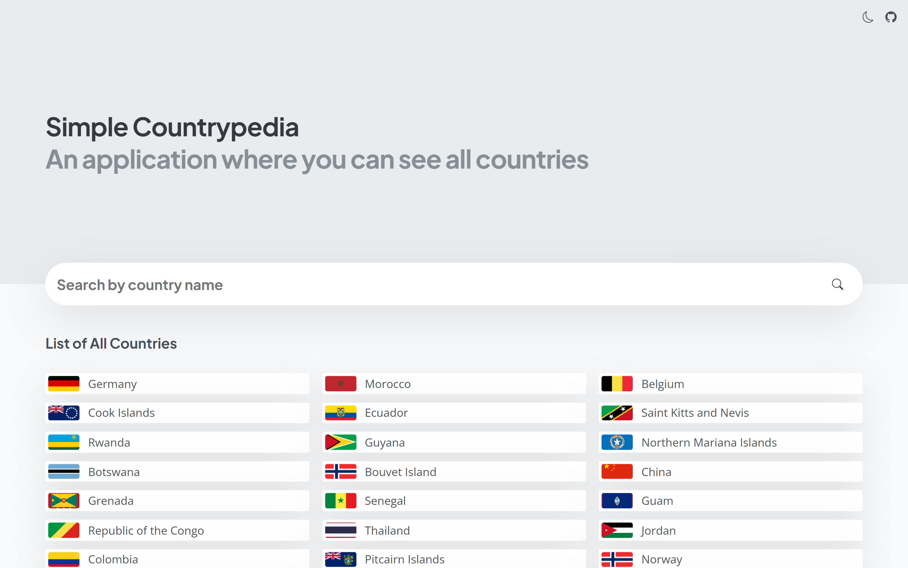</td>
    <td>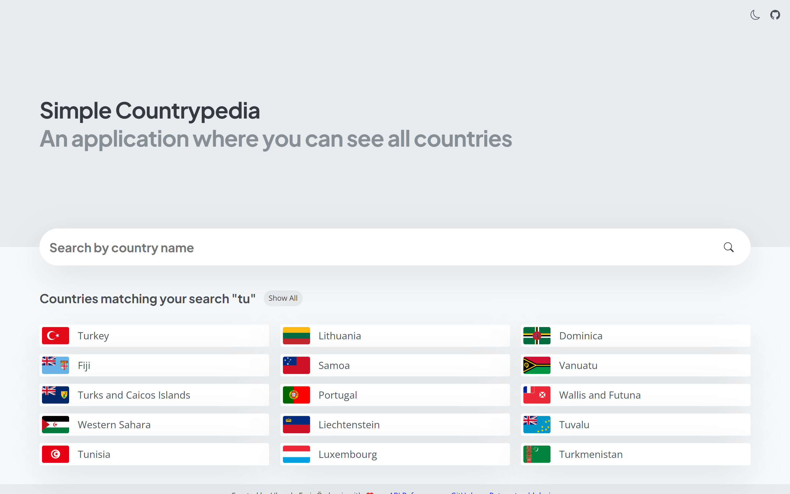</td>
    <td>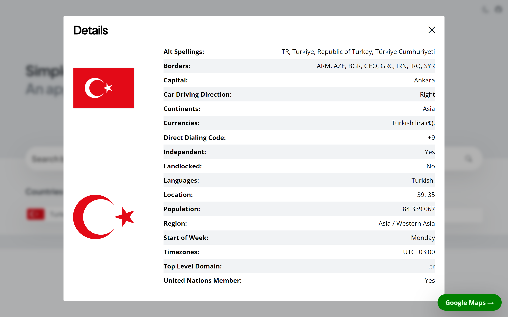</td>
  </tr> 
  <tr>
    <td>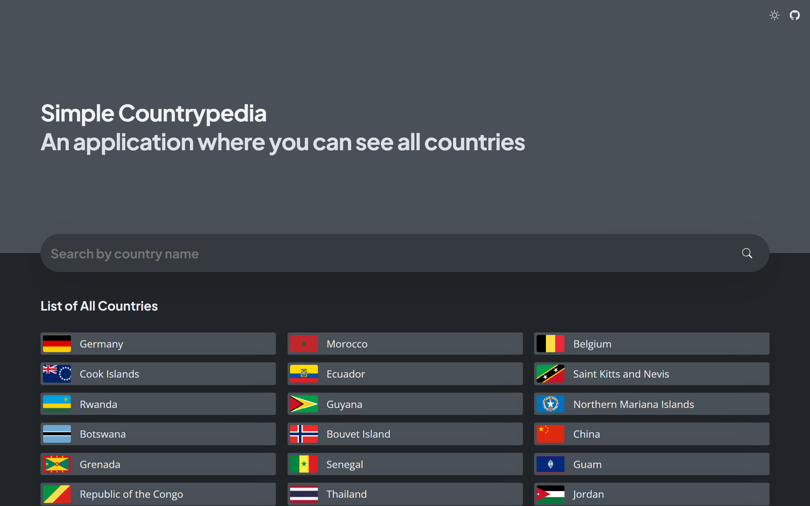</td>
    <td>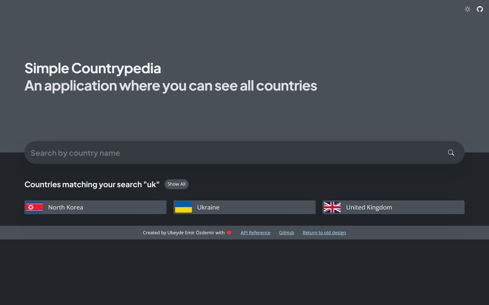</td>
    <td>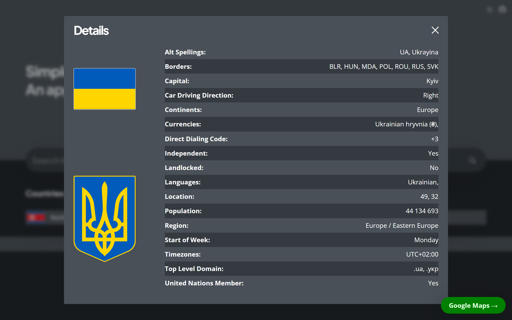</td>
  </tr>
</table>
<table>
  <tr>
    <td>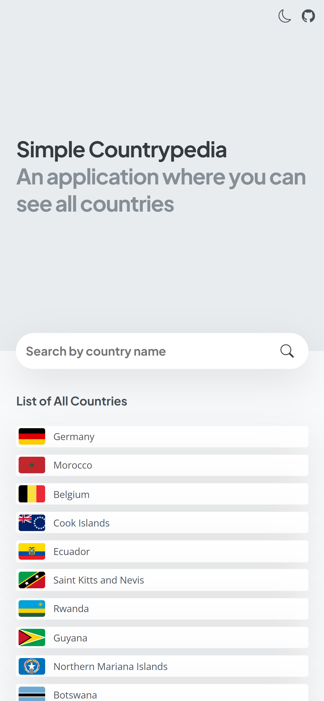</td>
    <td>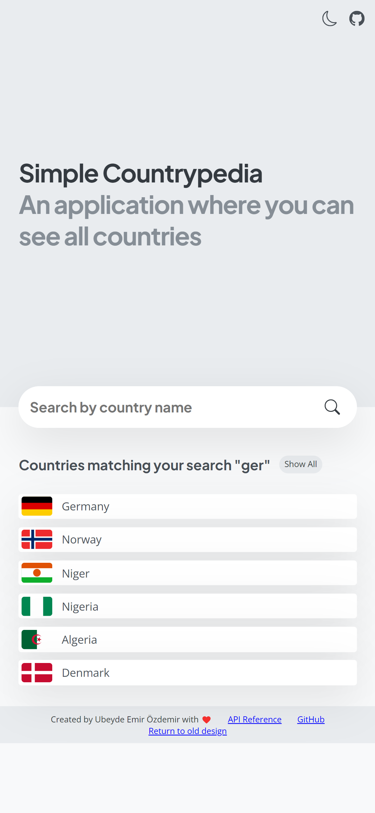</td>
    <td>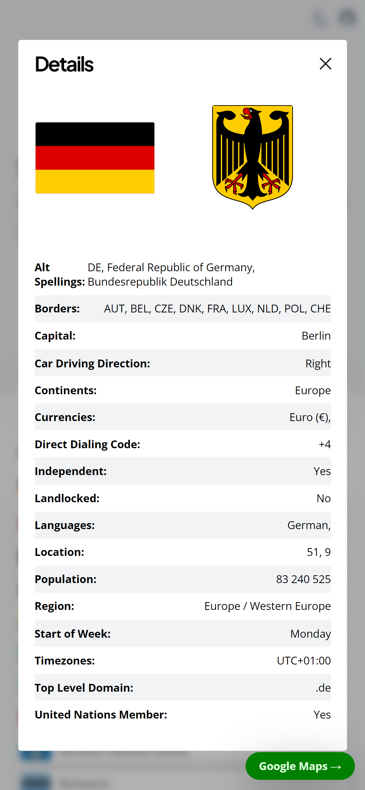</td>
    <td>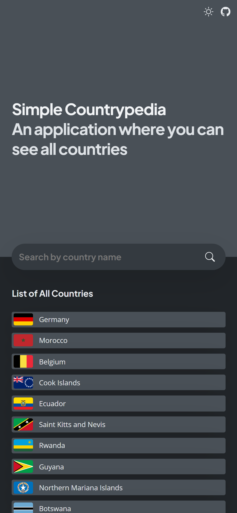</td>
    <td>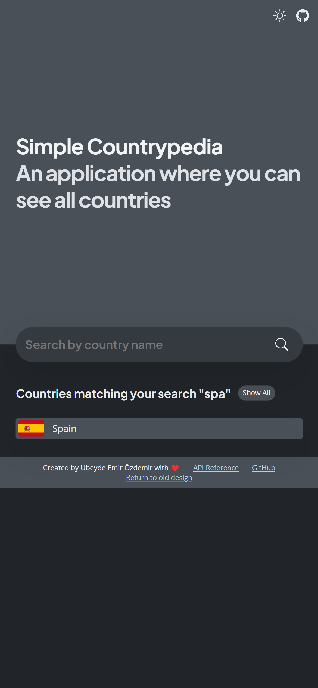</td>
    <td>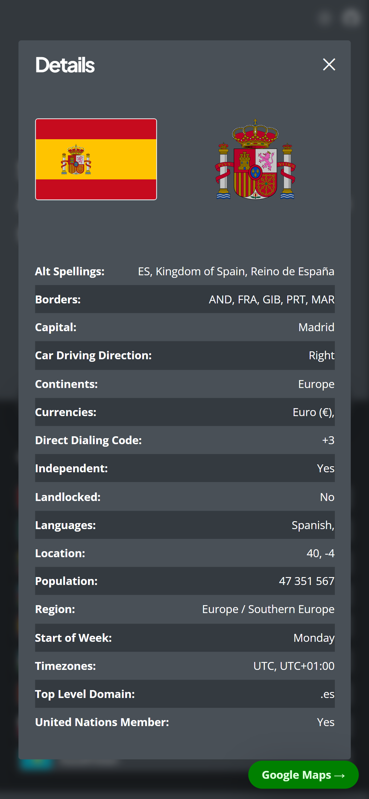</td>
  </tr>
</table>
