# Countrypedia

[](https://app.netlify.com/sites/simplecountrypedia/deploys)

This web application shows you the list of many countries. You can not only see the list of countries, but also search for countries, get information such as the flag, coat of arms, population, region of the country you selected. [Click here](https://countrypedia.app) for visit website.

## Development

The data of the countries' information is obtained from the [Rest Countries API](https://restcountries.com).
Map feature added, thanks to [Leaflet](https://leafletjs.com).

For running Countrypedia on your local machine, you need to install [Node.js](https://nodejs.org/en/) and [Yarn](https://yarnpkg.com) (or [npm](https://www.npmjs.com)).

Instructions for running Countrypedia on your local machine (based on npm):

```bash
# Clone the repository
git clone https://github.com/ubeydeozdmr/countrypedia.git
# Go to the project folder
cd countrypedia
# Install dependencies
npm install
# Run the project
npm start
```

## Working on V3

As I stated on [my website](https://ubeydeozdmr.github.io/),

> I plan to write the project from scratch with React and ChakraUI in 2023. This time I want to make improvements on both UI and UX side. Also, if the v3.2 version of the REST Countries API is released before this process is completed, I can add new information and write the object structures more easily in the project.

When I first wrote v2, it was actually just a design change (as you can see in Screenshots section below, because they are outdated), I added almost all of the features I mentioned in the What's new in v2 section below by patching it on the project. This caused the project to be written more cleanly at first, but later the code became harder to understand and the MVC structure was broken. Moreover, the URL based navigation I developed especially for phones caused new bugs.

Some bugs I've discovered so far:

- When you click on the Random button (the one with the 5 dot dice symbol), "cca3 codes" appear instead of the "full name" of the countries in the Borders section of the countries (When you select a country yourself, this part appears correctly)

- Regarding URL navigation: If the user exits the detailsView (closes the modal window) or returns to the main page using only the buttons or just the back button of the phone & PC after opening the site, it's fine. However, if it does both at once, the return function doesn't work as expected (needs to press go back button on browser or navigation drawer all the time).

So the point I want to focus on in v3 will be developability and user experience (UX) rather than design. I will use ChakraUI (probably) as design and write the project with React. As the project grows, it becomes harder to write and add/remove with VanillaJS (also error-prone), while React is quite flexible.

From this point on I will not add any new features to v2, only bug fixes and package updates (Max until end of 2024). I will also add a new section to the README.md file for v3.

**I will develop v3 on the development branch before fully releasing it. You can view it by** [clicking here](https://github.com/ubeydeozdmr/countrypedia/tree/dev).

**You can also review the new README.md. When it reaches a certain stage, the preview link will be shared. Also the to-do list for v3 is shown in this file. [Click here](https://github.com/ubeydeozdmr/countrypedia/blob/dev/README.md) to review.**

## Features

### What's new in v2

- Save the countries you want
- Show a country randomly
- Sort countries alphabetically or randomly
- Search from countries list by capital, currency, language, region etc.
- Map support for countries
- Import and export your saved countries
- Better animations and transitions
- URL based navigation
- GINI index on details page
- Full country names on borders section instead of cca3 codes (details page)
- Fix for direct calling code (details page)

### Others

- Dark theme support
- Search from countries list by country name
- Get information from the country card which you selected

## Contents

- Alt spellings
- Border countries
- Capital
- Car driving direction
- Coat of Arms
- Continents
- Currencies
- Direct dialing code
- Flag
- GINI index
- Independence status
- Landlocked status
- Languages
- Location
- Maps link
- Population
- Region
- Start of week
- Timezones
- Top-level domain
- United nations membership status

## Extra Notes

Countrypedia app may have bugs. For suggestions and corrections, you can make a merge request or open a new issue. You can edit this project, embed it and publish it yourself.

## Screenshots

| 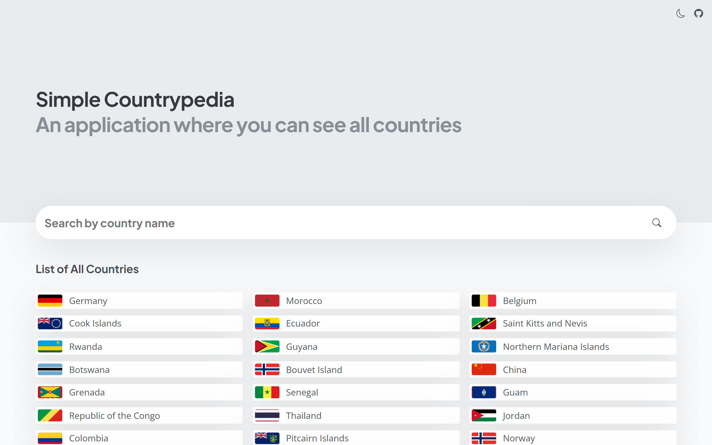 | 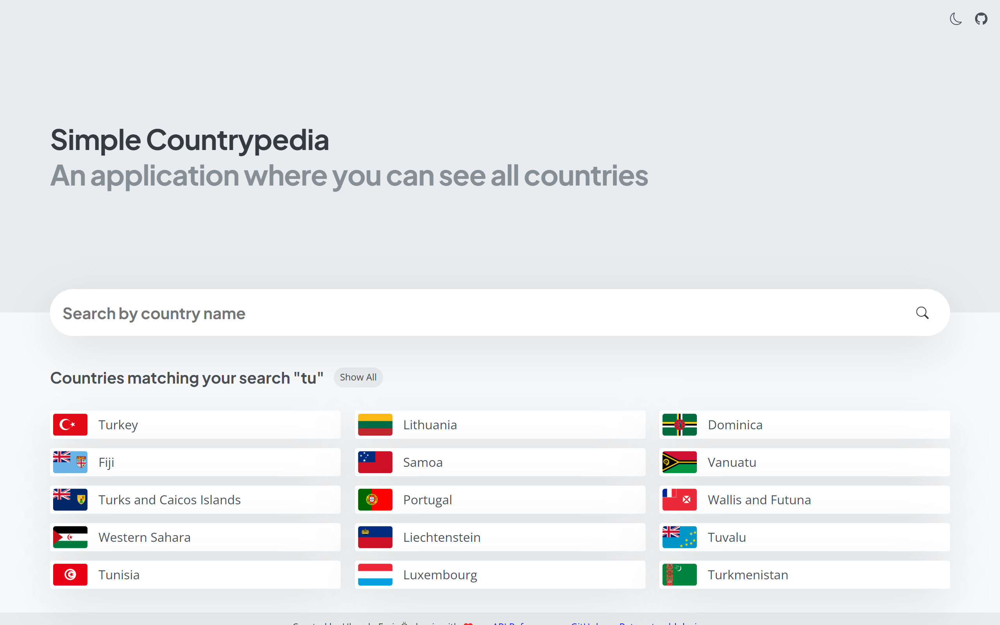 | 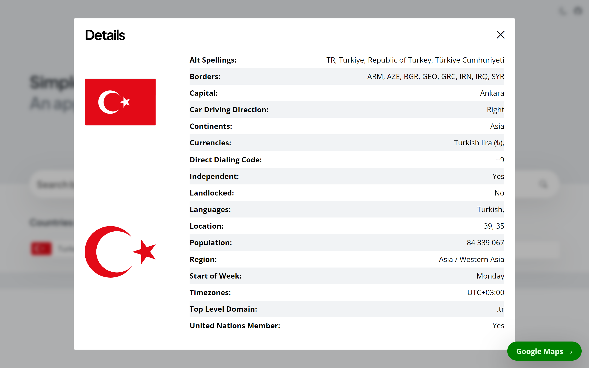 |
| ------------------------------------------------------------------------------- | --------------------------------------------------------------------------- | ----------------------------------------------------------------------------- |
| 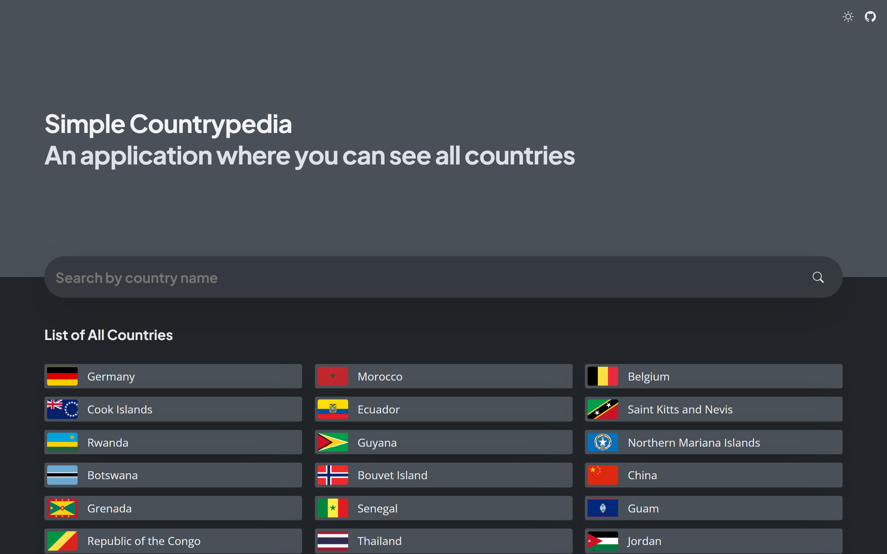  | 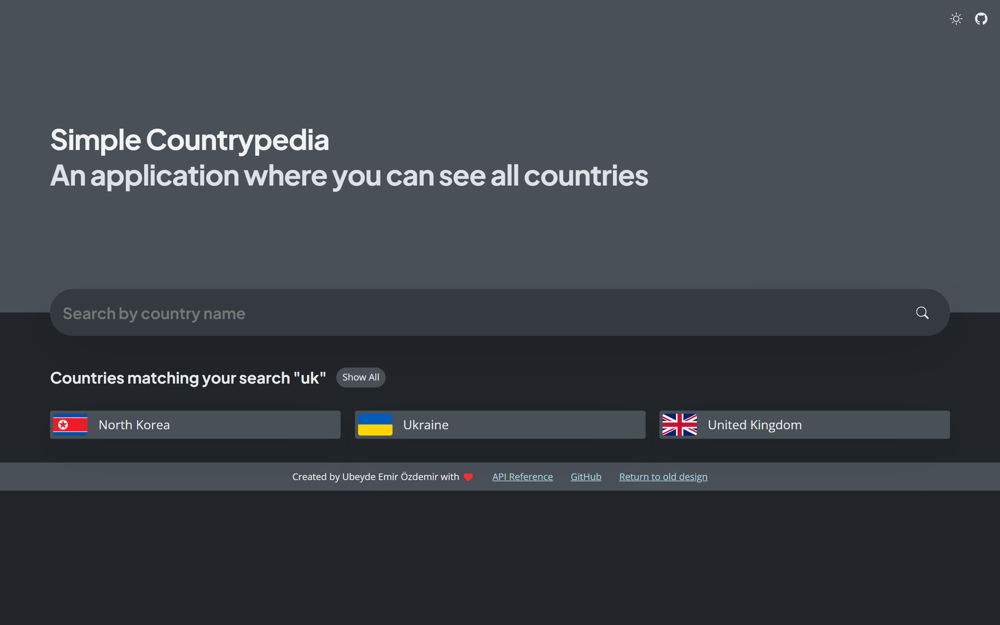  | 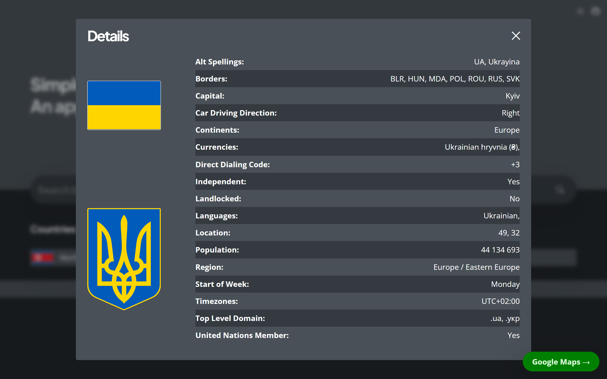  |

|                                                                                  |                                                                              |                                                                                |                                                                                 |                                                                             |                                                                               |
| -------------------------------------------------------------------------------- | ---------------------------------------------------------------------------- | ------------------------------------------------------------------------------ | ------------------------------------------------------------------------------- | --------------------------------------------------------------------------- | ----------------------------------------------------------------------------- |
| 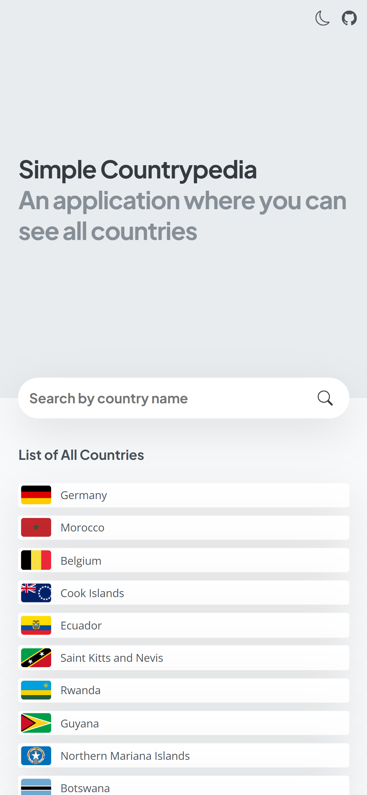 | 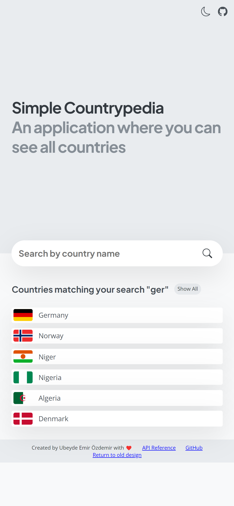 | 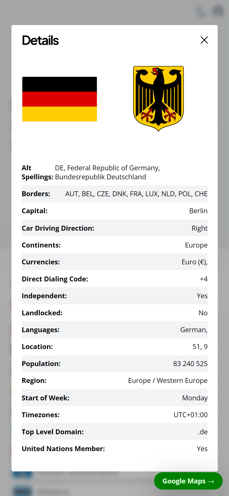 | 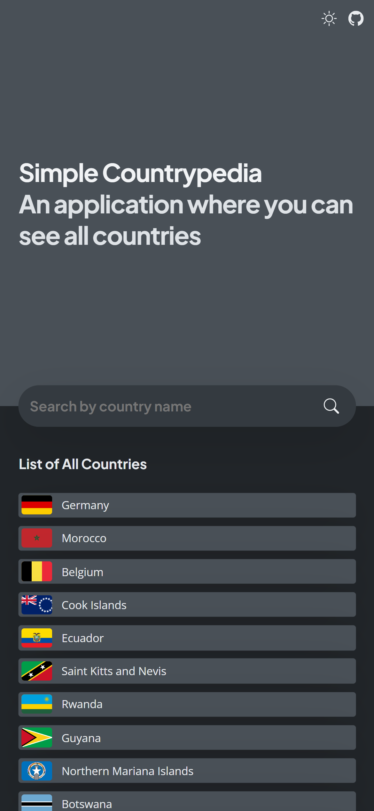 | 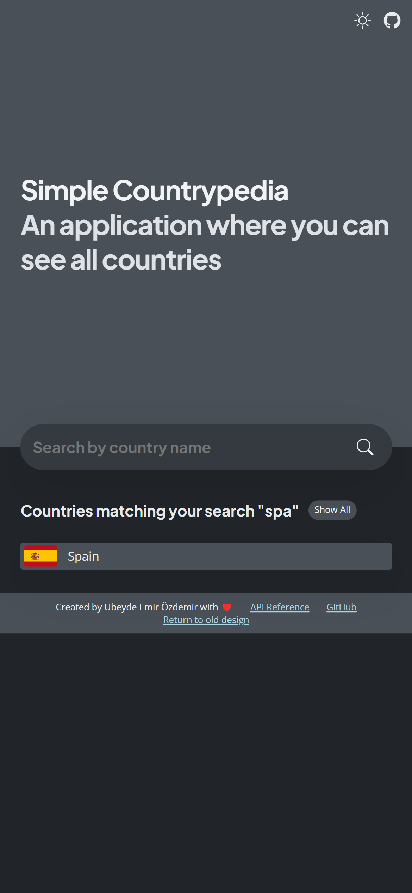 | 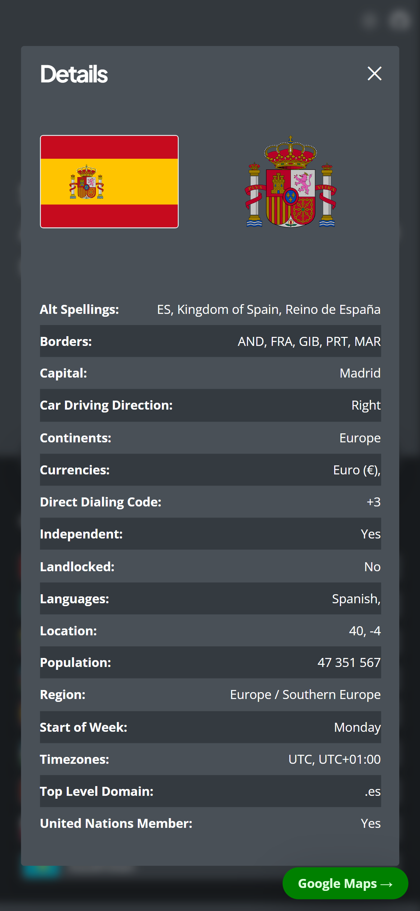 |
