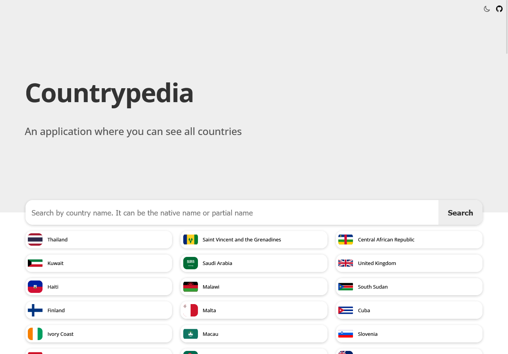
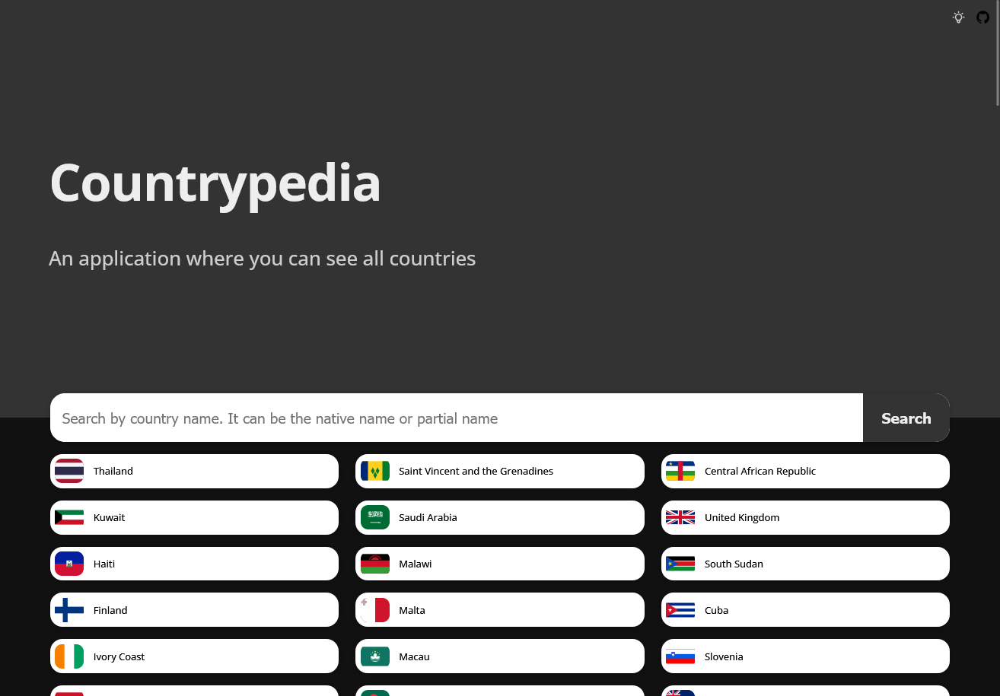
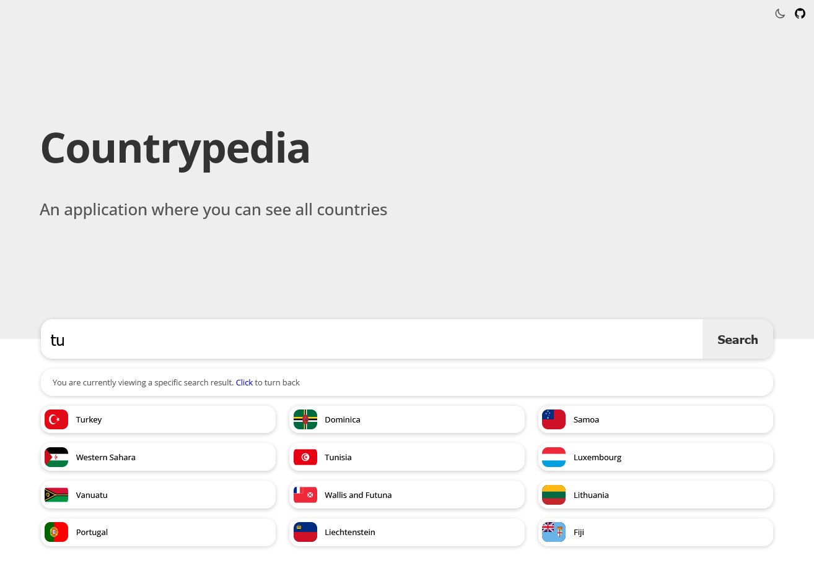
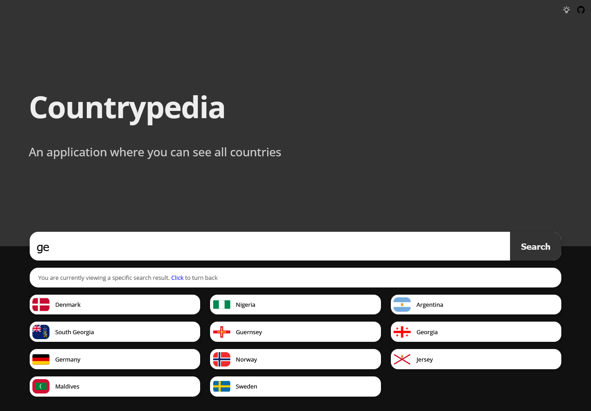

# Countrypedia

This web application shows you the list of many countries. You can not only see the list of countries, but also search for countries, get information such as the flag, coat of arms, population, region of the country you selected. [Click here](https://simplecountrypedia.netlify.app) for visit website.

# Development

This web application was created with [Rest Countries API](https://restcountries.com/).

# Features

- Dark theme support
- Search from countries list
- Get information from the country card which you selected

# Contents

- Alt spellings
- Border countries
- Capital
- Car driving direction
- Coat of Arms
- Continents
- Currencies
- Direct dialing code
- Flag
- Independence status
- Landlocked status
- Languages
- Location
- Maps link
- Population
- Region
- Start of week
- Timezones
- Top-level domain
- United nations membership status

# Extra Notes

This app is still under development so it may have bugs. For suggestions and corrections, you can make a pull request or contact me by email. You can edit this project, embed it and publish it yourself.

# Screenshots

