# IMPORTANT NOTE

**THIS VERSION (v1) IS NO LONGER MAINTAINED. YOU CAN VISIT THE NEW VERSION** [here](https://github.com/ubeydeozdmr/countrypedia) and [here](https://countrypedia.app)

## Countrypedia

This web application shows you the list of many countries. You can not only see the list of countries, but also search for countries, get information such as the flag, native name, population, and region of the country you selected. [Click here](https://v1.countrypedia.app) for visit website.

## Development

This web application has used to [REST Countries API](https://restcountries.com/) for getting the data of countries since early versions (2022-2026). But starting from mid 2026, the older API versions have been deprecated and now this web application uses [Country API](https://countries.dev/) for getting the data of countries.

### Control of the data

**IMPORTANT:** Please note that this web application uses the Country API for fetching country data, this means that the data exists in the Countrypedia web application depends on the Country API. That's why if some data is missing or incorrect, it may be due to the Country API. In this case, I have no control over the data, and I cannot fix it. If you want to report a problem with the data, you can contact the Country API team.

## Features

- Dark theme support
- Search from countries list
- Get information from the country card which you selected

## Contents

- Alt spellings
- Area
- Border countries
- Capital
- Country codes
- Currencies
- Demonym
- Direct dialing code
- Flag emoji
- Flag
- Gini index
- Independence status
- Languages
- Location
- Maps link
- Native name
- Population
- Population density
- Region
- Regional blocs
- Timezones
- Top-level domain

## Extra Notes

This app is still under development so it may have bugs. For suggestions and corrections, you can make a pull request or contact me by email. You can edit this project, embed it and publish it yourself.

## Screenshots

<table>
  <tr>
    <td>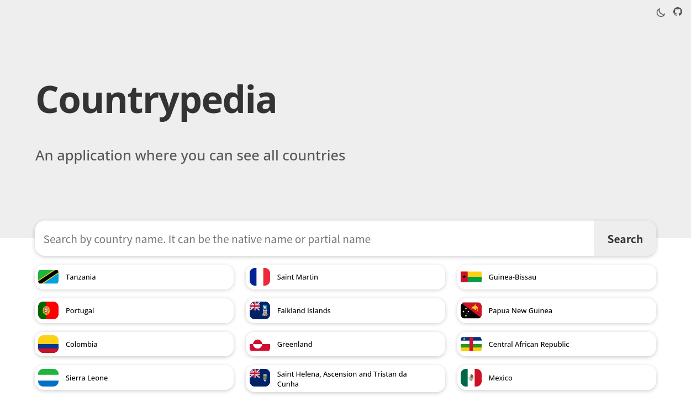</td>
    <td>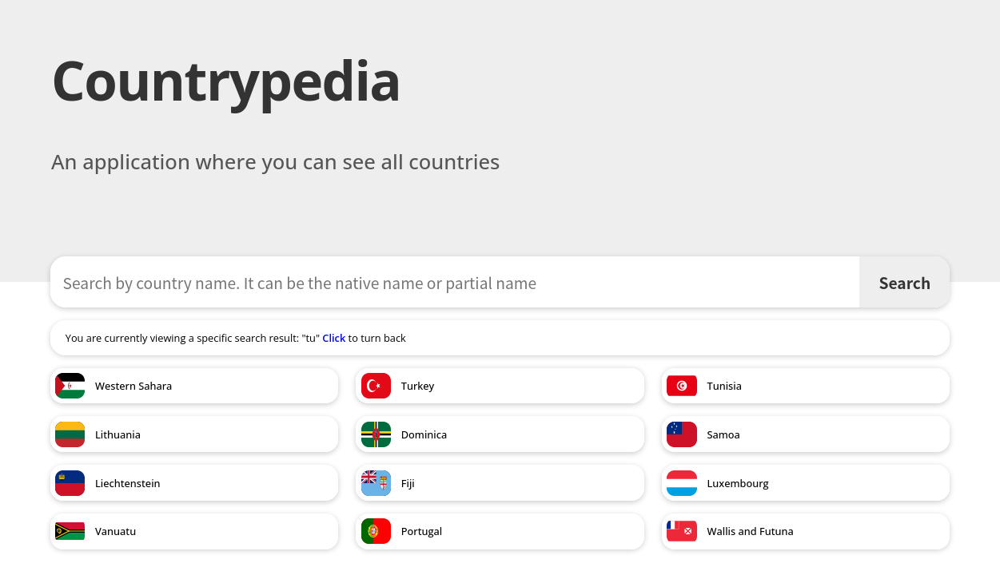</td>
    <td>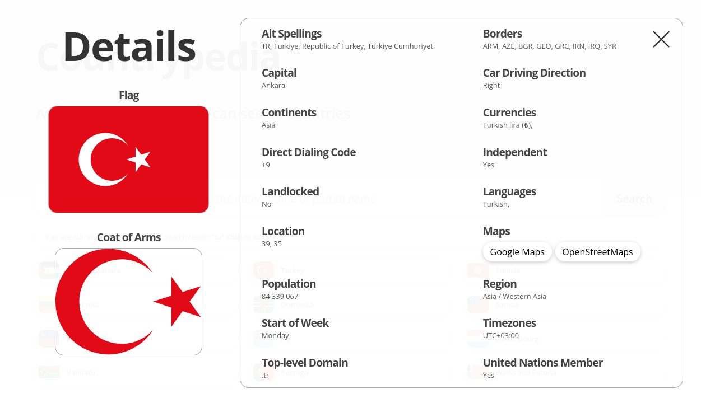</td>
  </tr> 
  <tr>
    <td>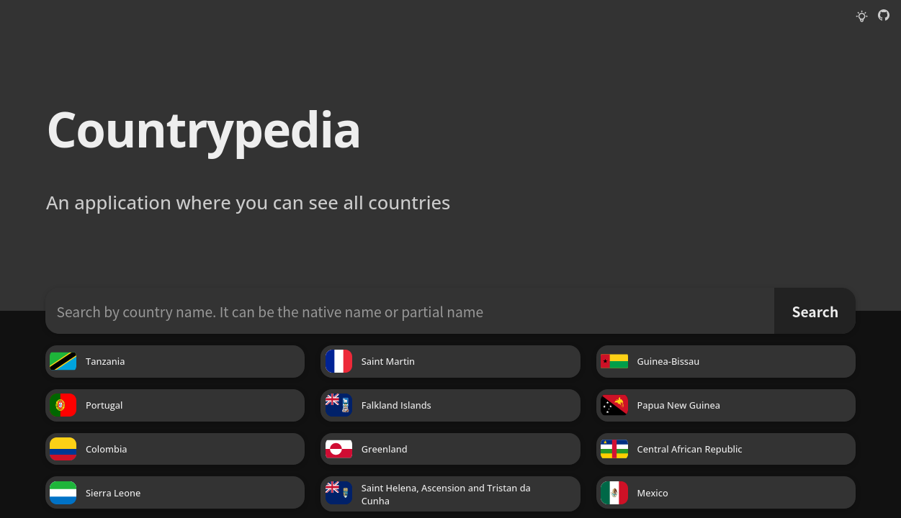</td>
    <td>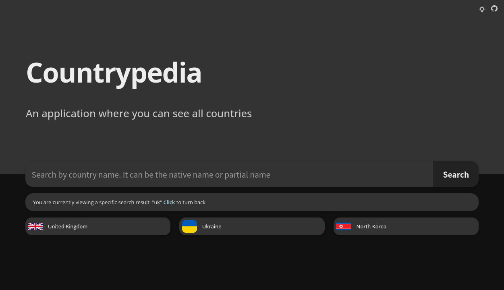</td>
    <td>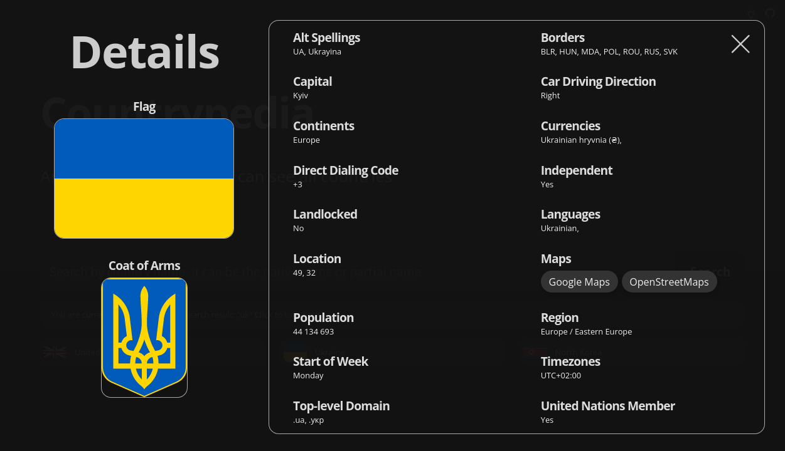</td>
  </tr>
</table>
<table>
  <tr>
    <td>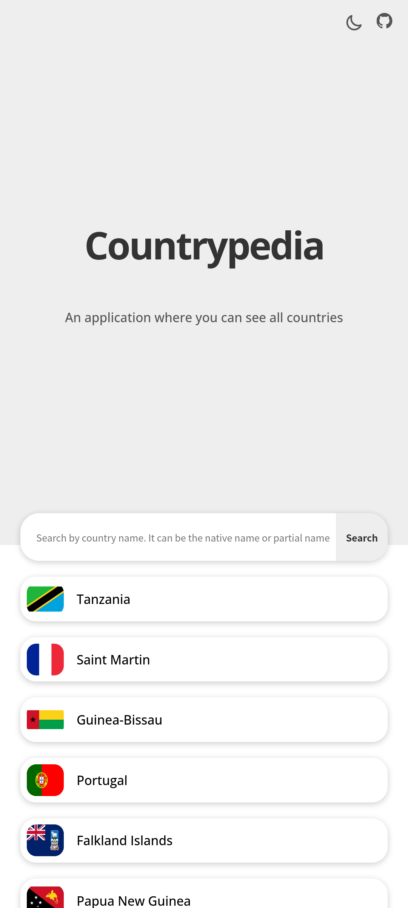</td>
    <td>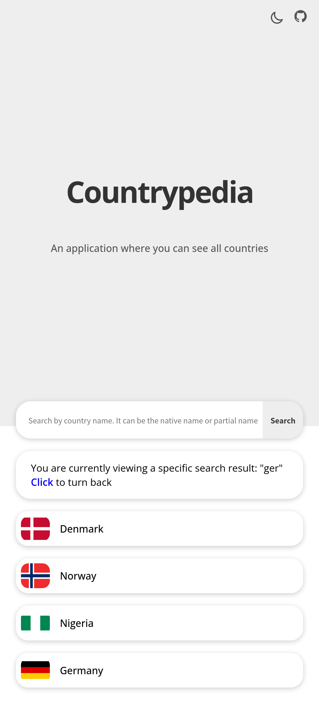</td>
    <td>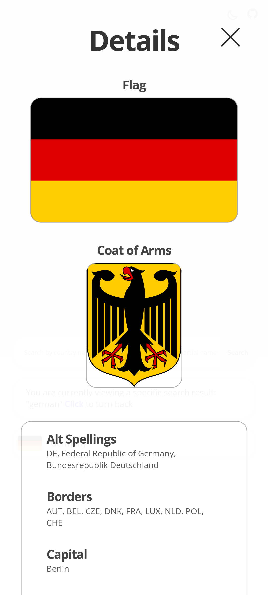</td>
    <td>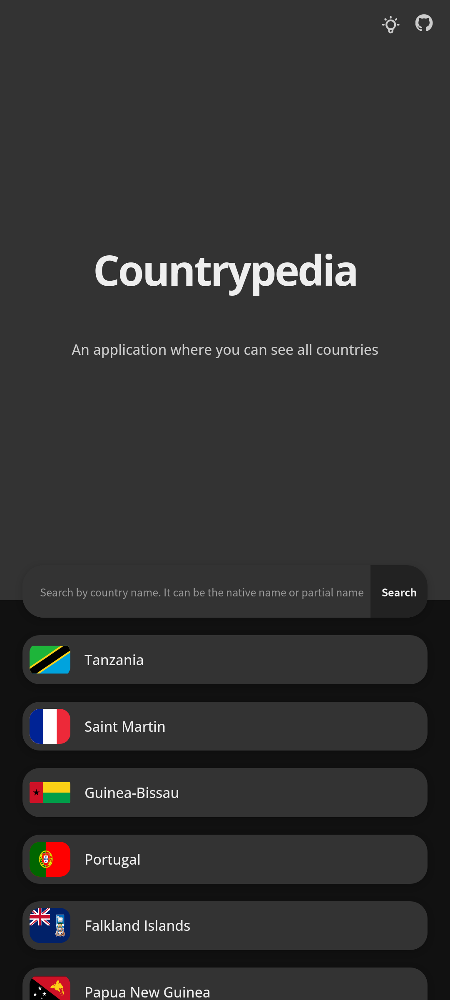</td>
    <td>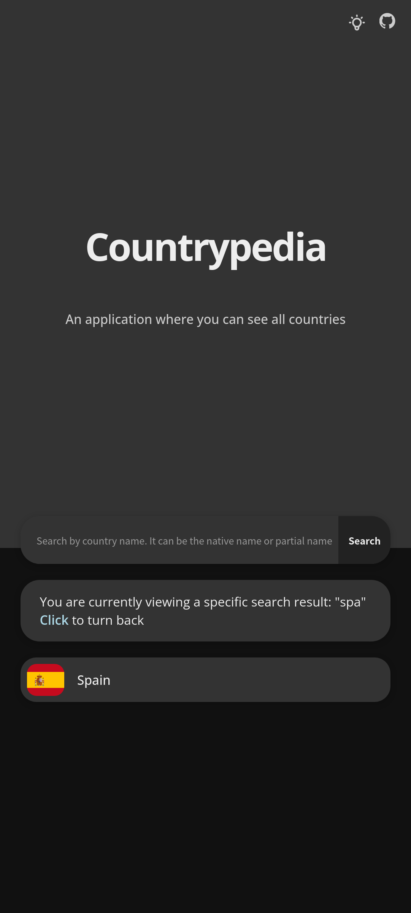</td>
    <td>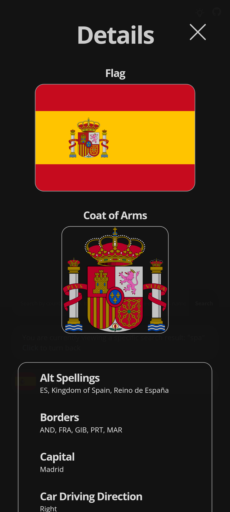</td>
  </tr>
</table>
